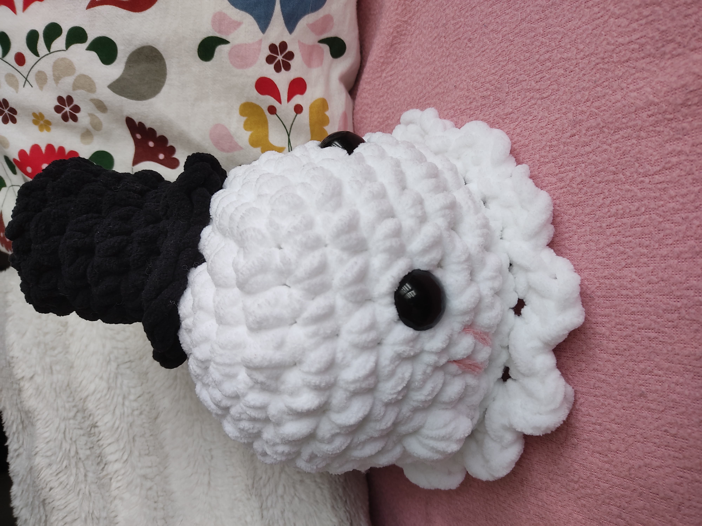

# Crochet beginners' guide

If you're new to crochet, here are a few steps to get you started.

## Materials required

- **A hook** _(between 4mm and 6mm to start with)_
- **Wool**: _choose a medium-sized wool_  
-  ~~Avoid using threads that are too thin or too thick at first.~~

---

## List of basic points

1. [Chain stitch](https://youtu.be/31A-5SqUMJY?si=A84k638KBxLT2aqz)
2. [Tight stitch](https://youtu.be/3PoLOhGpwJ0?si=kZ2KhUQzBnYqfBwX)
3. [Half-flange](https://youtu.be/l1w3HidZC1g?si=VNSAgcBeDpMm7io0)
4. [Increase](https://youtu.be/NCHvJ9PbMPQ?si=WD-_iMYl8Pmlq-Wn)
5. [Decrease](https://youtu.be/uzmBW6M2Qvo?si=74h2qjCra51T1iZR)

These links will take you to some great tutorials on the basics of crochet.

# Here's an example of a project for beginners 

* Small **bee** that can be hung as a key ring 🐝

 

You can also use these __jellyfish__ as an example.

     

* Here are a few examples using chenille wool. If you want to tempt the bee with this kind of ball, adapt the pattern as the yarn is much thicker.

 

Have fun! 👻

Visit our advanced [projects page](page3.md) for more challenges.

