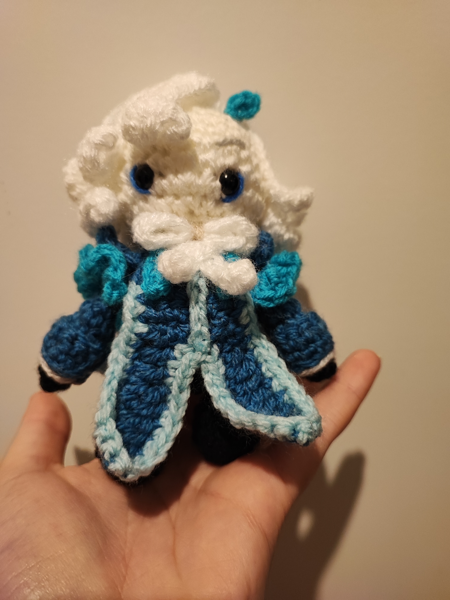

# Projets avancés en crochet

Une fois les bases maîtrisées, vous pouvez commencer des projets plus complexes, tels que des couvertures ou des vêtements.

## Projets suggérés

- **Couverture hexagonale** (_technique intermédiaire_)
- **Écharpe à motifs** (_technique avancée_)
- **Personnages fictifs** (_techique avancée

---

