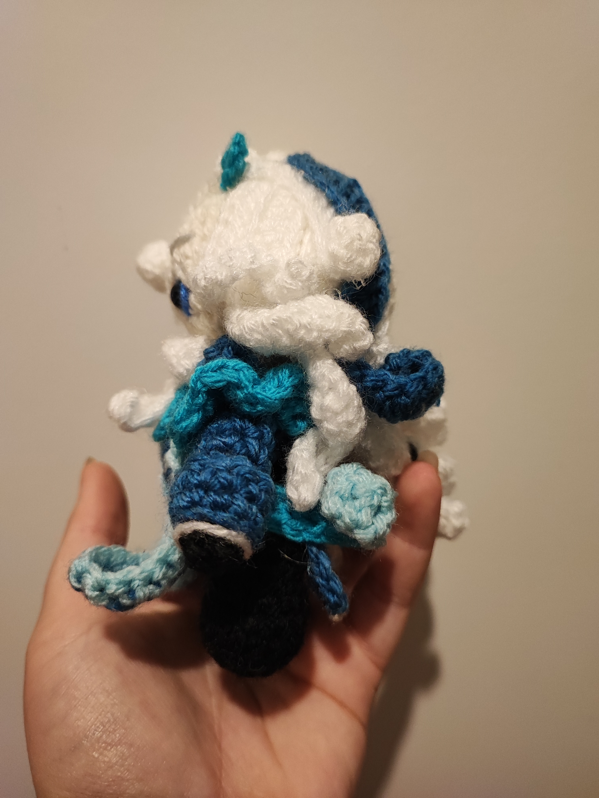
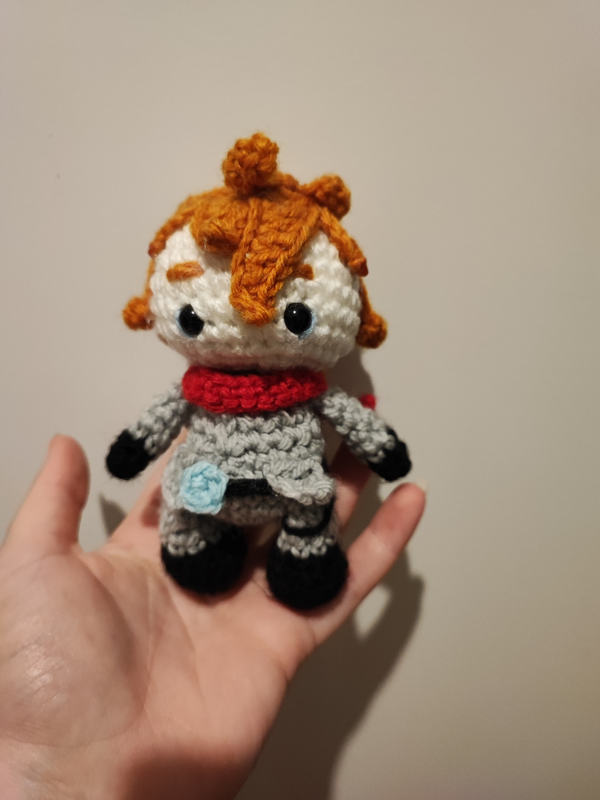
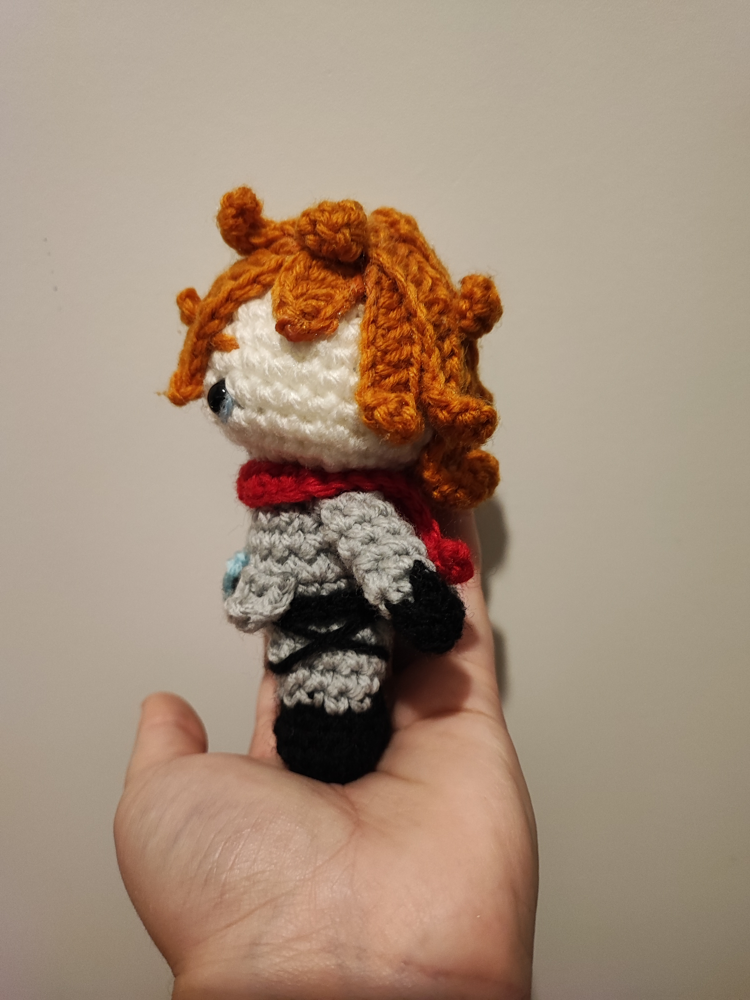

# Projets avancés en crochet

Une fois les bases maîtrisées, vous pouvez commencer des projets plus complexes, tels que des couvertures ou des vêtements.

## Projets suggérés

- **Peluche sur socle** (_technique intermédiaire_)

          

    

- **Écharpe à motifs** (_technique avancée_)
- **Personnages fictifs** (_techique avancée_)

        

           

> Ces personnages viennent d'un jeux vidéo nommé **genshin**. Ils demandent beaucoup plus de temps et de technique, donc je vous recommande vivement de commencer avec des projets de niveau intermédiaire. Cela vous permettra de vivre une expérience enrichissante et agréable !

* Voici la liste du matériel nécessaire :
        * Pelote de laine
        * Crochet taille 2.5-3 mm
        * Marqueurs
        * Pistolet colle chaude

---

